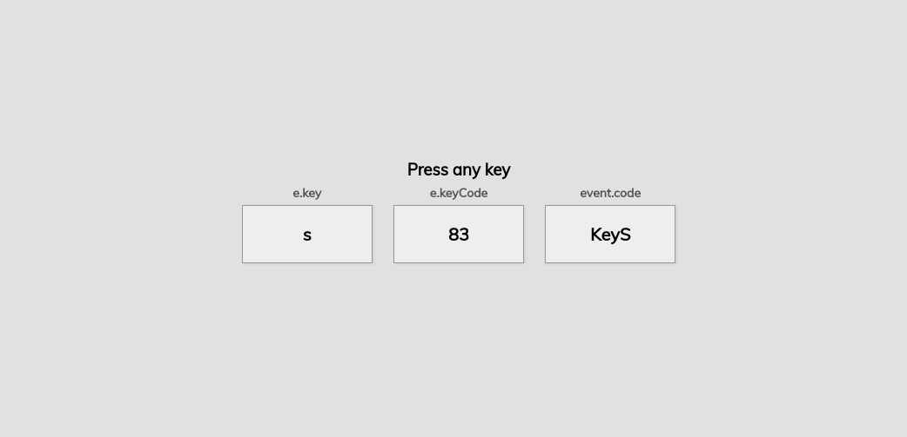

### KeyCode
Project in vanillaJS to get JS event KeyCodes 

See Javascript keycodes in realtime by pressing corresponding keys.

This is inspired by the [Toptal](https://www.toptal.com/developers/keycode)'s key code event tool

The project is only optimised for desktop devices for now.

Full disclosure - I've used index.html and style.css as templates whereas script.js was written from scratch.

Preview - 

